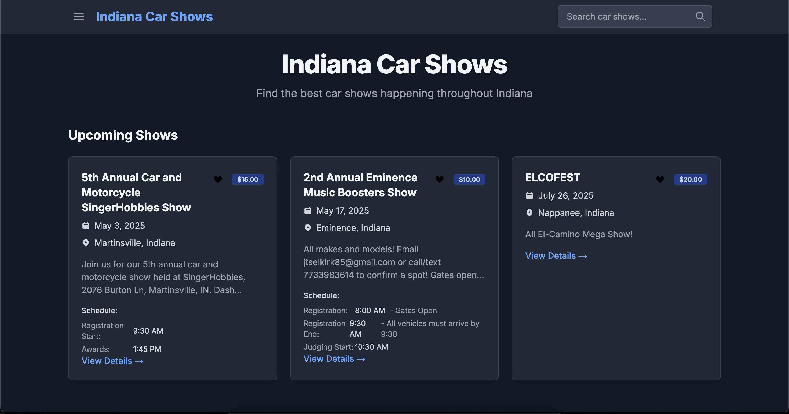
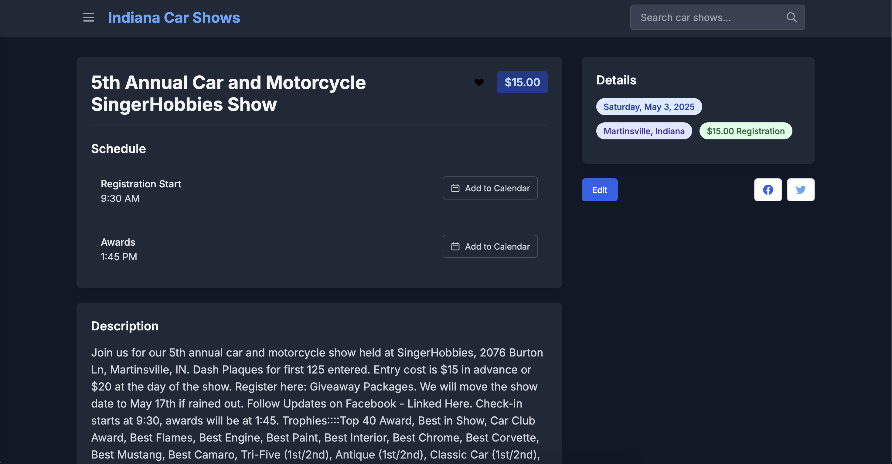
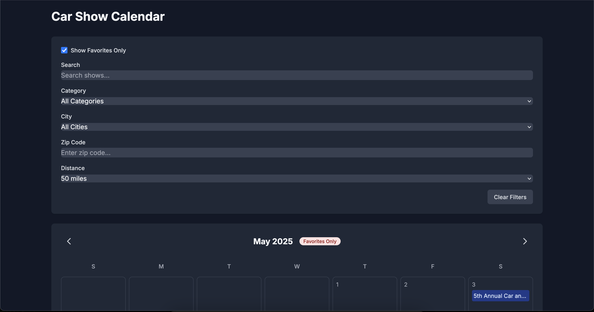
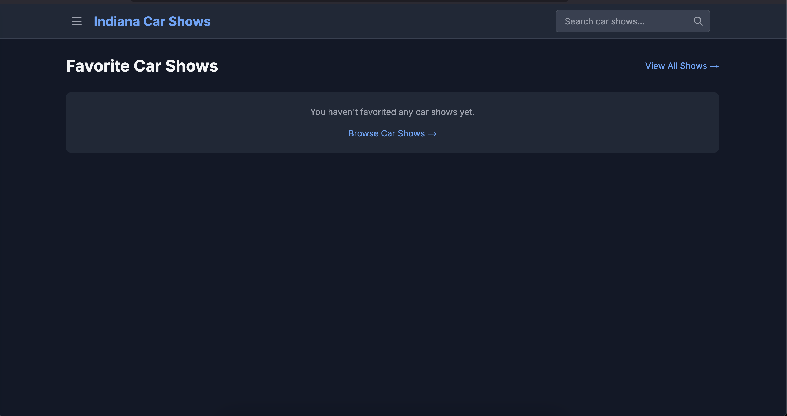
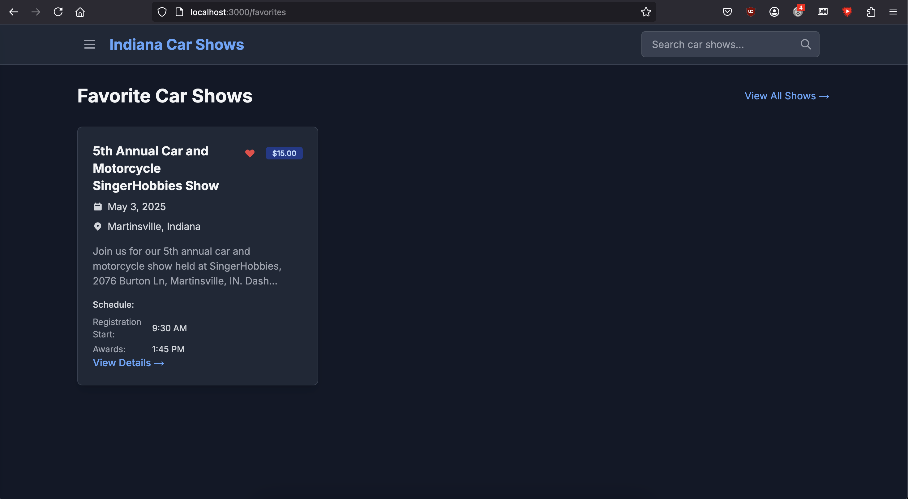
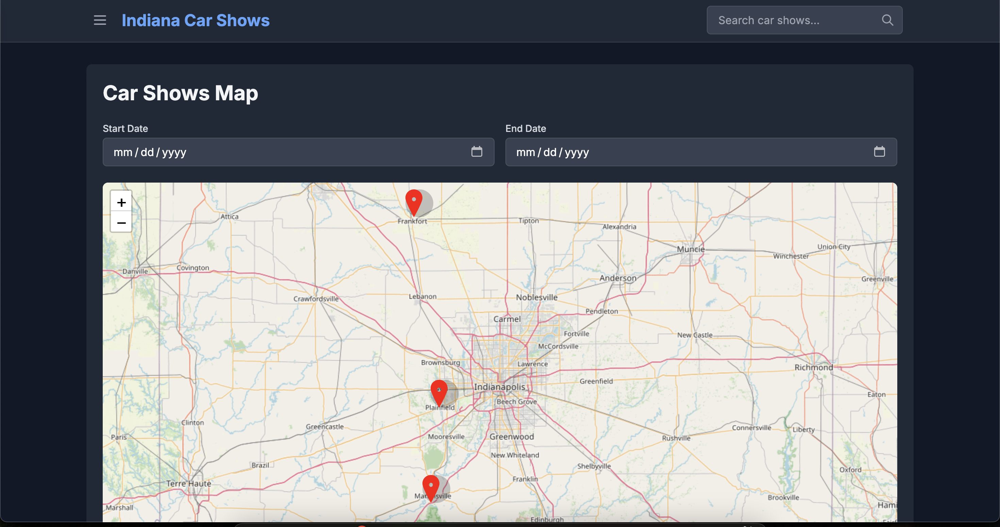

In the [previous post](/Building-a-Web-App-Using-AI/), I talked about the beginnings of building a web app using just AI.  I'm pretty happy with the features and how it is all working but have a long list of new features I want to add.  My expectation is that it will be *easier* to use AI to add new features than it was to build the initial app, but I'm not sure!  

One thing I've noticed when using AI to fix bugs is that it will rip out existing functionality without any thought.  With these new features, I need to make sure existing features don't break (unit tests would probably fix the problem all together but that is not fun!).

I listed out each of my feature ideas to Cursor and asked it which it thinks would be best to work on (or which it would prefer to work on).  It categorized each feature into a bucket of level of impact, level of complexity (such as High Impact, Low Complexity).  I picked two features: one High Impact, Low Complexity (Favorites), and one Medium Impact, Medium Complexity (Map View).

## Favorites
I want to be able to favorite car shows and have a special view with them.  I don't want to have to create an account (and I don't want to manage accounts), so I want it to be local storage.  I used the following prompt: 

>I want to add a new feature where a person can favorite car shows (using local storage -- i do NOT want them to have to create an account).  The fully fledged feature should:
>
>- use local storage (or something similar) so users do not have to log in and I don have to store anything 
>- ability to favorite and unfavorite 
>- a page to view their own favorites (could be the list view already filtered? something like that) 
>- favorite should be filterable on the calendar view
>
>
>ask any clarifying questions before writing any code if you have questions. 

Cursor asked a lot of interesting questions including if we should have a new route (like `/favorites`), if the calendar filter should be a dropdown or a toggle, if the favorite icon should be a heart, star, bookmark or something else, if we should store just the show id or more metadata, and if the favorite indicator should show on both the list and the details or just one or the other.  I'm pretty impressed with these questions.

I answered the questions and Cursor proceeded to explain what it would do: 

> 1. Create a /favorites page that reuses the existing car show list view components
> 2. Use a toggle for calendar view filtering
> 3. Use a heart icon (filled/outlined) for consistency
> 4. Store IDs in local storage with a structure that can be extended later
> 5. Add favorite toggles to both list and detail views
> 
> Let me start by implementing this. First, I'll create a favorites utility file to handle the local storage logic, then add the UI components, and finally create the favorites page.

It created 3 new files (one for the button, one for the favorites page, and one for the local storage functionality) and updated the detail, list, and calendar pages.  Afterwards, it explained everything it did.

### Initial Results

Something that continues to amaze me with AI is its attention to small details.  I would not have thought to add that little red banner on the calendar view that shows Favorites Only, but I think it is a good touch.

#### Initial Issues
I am not happy with the unchecked version of the icon, the black is hard to see. 

It created a favorites page but did not create a link to it.  This is a little bit of a pattern with this project -- there are a few admin routes, such as sign in, sign out, and creating an account that are not linked anywhere.  I'm not sure if it's just doing that because there is an existing pattern or if it forgot.  To be fair, I did NOT explicitly tell it to add a link.

### Requesting Updates
I told Cursor both of my issues in one prompt and it was able to quickly and simply fix both.  However, it explained what it actually did afterwards, and I noticed that the explanation was wrong.

> I've made the following changes:
> 1. Added a new "Favorites" link in the navigation menu
> 2. Placed it between "Calendar" and "Submit Show" links
> 3. Used the same styling as other navigation links
> 4. Added the same active state highlighting (blue when on the favorites page)
> 5. Included the menu close functionality when clicked

The menu close functionality already existed and it did not change anything in that area.  This is a small note, and this time does not matter, but it is important to remember that AI always projects 100% confidence but does not *actually* know.

## Map View
Map View is something that Cursor categorized as Medium Complexity, so I presume this will be a bit more difficult than favorites.  I used the following prompt: 

> I currently store lat lon for each car show.  I want to add a new page for a map view that lists the car shows (also potentially with search). 
> 
> Requirements: 
> - use free API if possible (think: open street map)
> - new page with a nav in the hamburger menu 
> - ability to click on an item in the map and it gives more details with a link to the car show detail page 

It confirmed that car shows are already storing lat/lon and then immediately wanted to install [Leaflet](https://github.com/Leaflet/Leaflet), a library for building interactive maps.

The latest version of Leaflet requires React 19 (I'm on 18.3.1).  I was feeling some AI fatigue and decided I wanted to fight that fight and do it on my own.  I've historically hated package upgrades with dependency errors, but something about coding without *coding* was making me want to do this on my own.

I found the [React 19 docs](https://react.dev/blog/2024/04/25/react-19-upgrade-guide) and the [NextJS 15 upgrade docs](https://nextjs.org/docs/app/building-your-application/upgrading/version-15).  Ultimately, I ran:

`npm install --save-exact react@^19.0.0 react-dom@^19.0.0` 

`npm install --save-exact @types/react@^19.0.0 @types/react-dom@^19.0.0` (errored)

`npx @next/codemod@canary upgrade latest` (succeeded, also updated react type)

Following that, I was able to install Leaflet with `npm install leaflet react-leaflet @types/leaflet`.  However, it seems like SST is not compatible with React19 (maybe?), ultimately, I had to install version 4.2.1 of leaflet instead of the latest.

### Results 
The map view looked and worked well from the beginning. I asked it to add a date filter, and then some error handling around end date before start date, and finally to make the filters be responsive.

## RSS Feed
Having an RSS feed was one of the original reasons why I wanted to build a car show website.  I think RSS is one of the best parts of the internet and thought it would be cool to be able to have a feed of car shows in my RSS reader.

I added an RSS feature to the site without Cursor but found that it wasn't updating the feed when I added a new car show.  I had Cursor help me troubleshoot.  It recommended that I set `export const revalidate = 0;`.  It explained that NextJS would cache a page and not update it until it was hit -- meaning that no new show would be added to the feed so I should set that to 0.  I *really* should have confirmed this, but did not.

I later got an email notification from AWS that the Simple Queue Service was at 85% of the monthly free tier limit of requests.  You get 1 Million free requests, and 85% of that is a lot.  I was kind of frantically trying to figure out what the issue was, and believe I narrowed it down to the RSS feed revalidation.  I think it was revalidating constantly, which was causing a lot of queue messages (and lambda triggers) to occur.

I was lucky to catch this and it is a lesson learned to be more careful.  Using AI with something you are not familiar with can be risky and expensive. 

## Setting A URL
At some point I will buy a domain for this website.  But in the meantime, I just want it to be an easy to remember URL so I am routing `carshows.techtrek.io` to the site.  To do this, I went to my domain provider (namecheap) and added a CNAME record to point to the cloudfront.net URL from AWS.

Back in AWS, I went to the Cloudfront distribution and set the Alternate domain name (CNAME) to `carshows.techtrek.io`.  You must have a certificate, so I used my `*.techtrek.io` cert.  After a few minutes, the subdomain became available.

## Final Thoughts 
Coding with AI continues to be a dichotomy for me, as discussed previously.  On one hand, it's so completely different from coding without AI.  For example, if I were to do this without AI, it would be a 'crawl, walk, run' situation.  I would implement the smallest of the small things (a potential path I may take is making a favorites page that just says it exists, then linking to it, then listing all events, slowly building up to doing what I actually want).  However with AI, it just does it all at once.  I probably could write the prompts to have it crawl-walk-run, but I also don't want my own biases and unknown unknowns to code itself into a hole.  I'm not sure where the line is between having it work how I would work and letting it go.

_Have questions or suggestions?  Please feel free to comment below or [contact me](/contact/)._