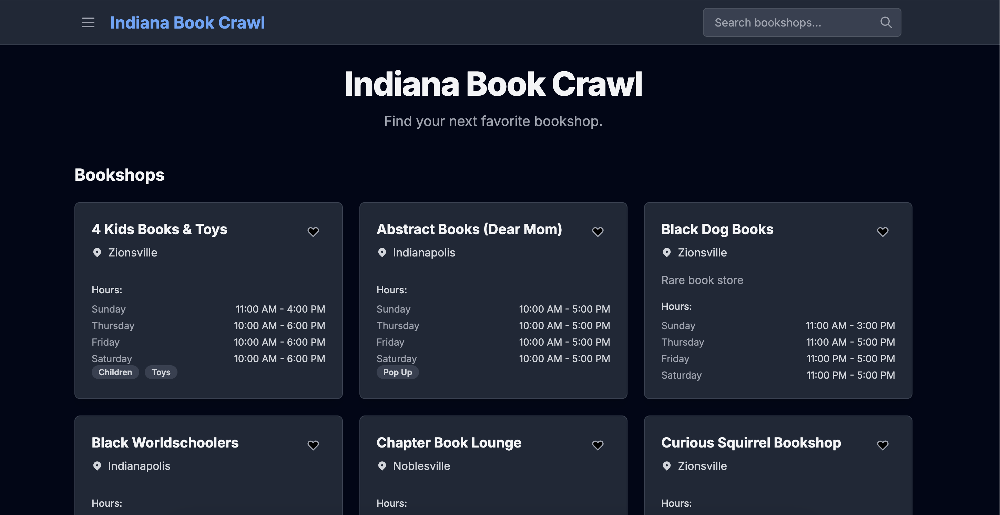
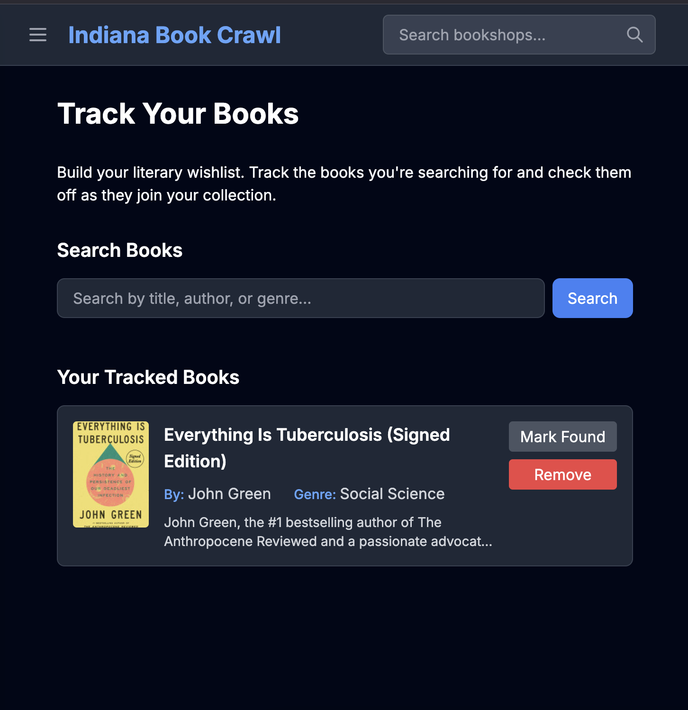
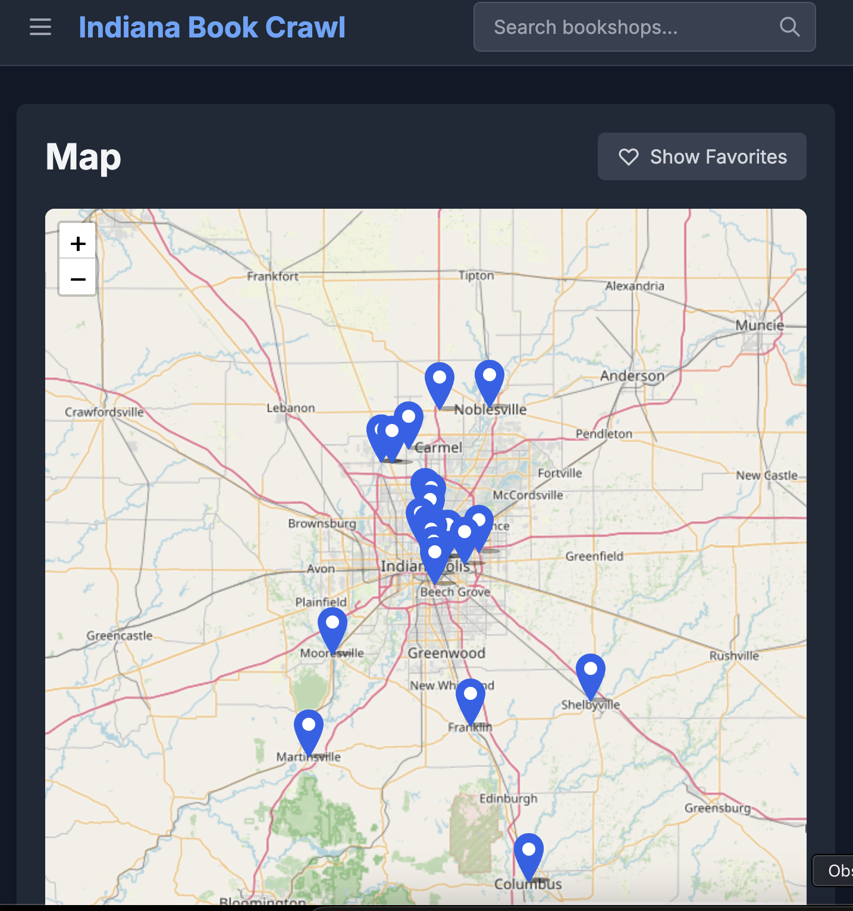

This weekend, local bookshops are hosting the [Indy Indie Book Crawl](https://docs.google.com/forms/d/e/1FAIpQLSeWk0ACYmHZtwPMDcq1A6rZbfak4qq4LjMPz1MgcJiXIiK3Kg/viewform) for the second year.  The goal of the book crawl is to support local, independent, and community bookstores and shops across central Indiana.  This year, nearly 30 local shops participated.

This was my first year hearing about it, and I absolutely love the idea.  You can pick up a bookmark at a participating store, get stamps on it at each store you visit, and be entered in for prizes.  There is also a bingo card and several shops are hosting events throughout the weekend.

# The Issue
However, the official website for this event is a Google Form.  There are links in the Google Form to another Google Doc with the participating shops and their hours, and another link for events.  It is frustrating to use because you can't easily tell what the bookshops are about or where they are located.  As I thought about it more, I realized that my [Car Show Website](../Building-a-Web-App-Using-AI) already had all of the features I would want in a book crawl website.  Specifically, I had already built a way to submit a show with a name, description, location, hours, and categories.  Luckily, these are the same things I would want on a book crawl website.  So, I got to work.

# The Final Result

Here are pictures of the final website.  It looks exactly like my Car Show site because it is.  There are a few slight differences:

- Only admins can create book shops 
- There is not a concept of 'approved' bookshops (though I half did it, so if I wanted to finish the implementation it would mostly only be turning on the filtering in the endpoints)
- The card displays are slightly different as the information I care about is slightly different 
- The Favorites includes a map 
- I added a book wishlist so you can track the books you are looking for and mark them off 

# Obstacles 
I started working on this Thursday evening (the event started on Thursday).  I should have started it sooner but I didn't have the thought fully formed until then.  I also thought I would try using only AI and start from scratch.  This was a mistake.  

AI can be a great tool, but I'm finding it is best for smaller, more oriented tasks.  Trying to get something up and running quickly using only AI is a recipe for disaster.  It is much easier and faster to build what you know, and use AI to fill in the gaps.  I abandoned the AI-only approach due to time constraints, and used my car show project as a guide.  

# Real World Usage
Using the website during the event was overall a success, but naturally we identified some nice-to-have features that I would like to add before next year.  Those include: 

## A way to see the next closest book store
This could take a few forms.  Either allowing the site to see your location, having some 'map my route' feature that maps your selected shops in the least distance, or even something that lets you click on one of the shops then the other shops are color coded based on distance. 

## More information about the bookshops
This one is mostly because I ran out of time, but I wish I had spent more time putting descriptions and tags on the bookshops so that we could easily see what the bookshop is about.

## Ability to see which shops are open/closed or closing soon
This wasn't an issue for us since we went out in the morning, but it would be nice to have some sort of a way to know that a bookshop was closed or closing soon so that we would know not to head that way.

# Conclusion
I wish that I had put this under a real domain (even if just crawl.techtrek.io or something).  I heard many people lamenting that there was no map, no way to see info about bookstores, etc on the provided website.  It would have been really cool to been able to point them to my website (I could have also made a QR code maybe but scanning a random person's QR code is sketchy and the URL is sketchy so I'm not sure how that would have worked).

_Have questions or suggestions?  Please feel free to comment below or [contact me](/contact/)._