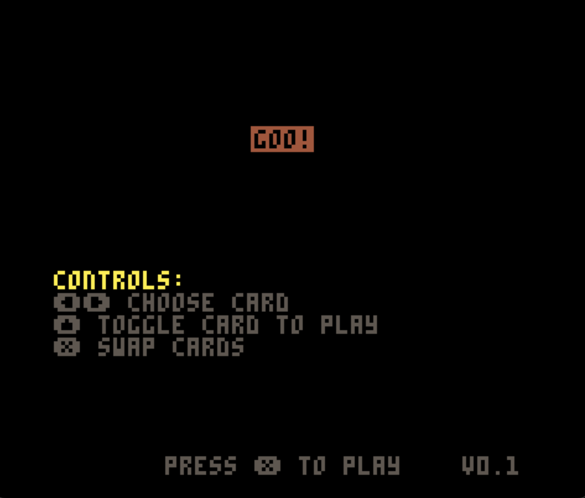
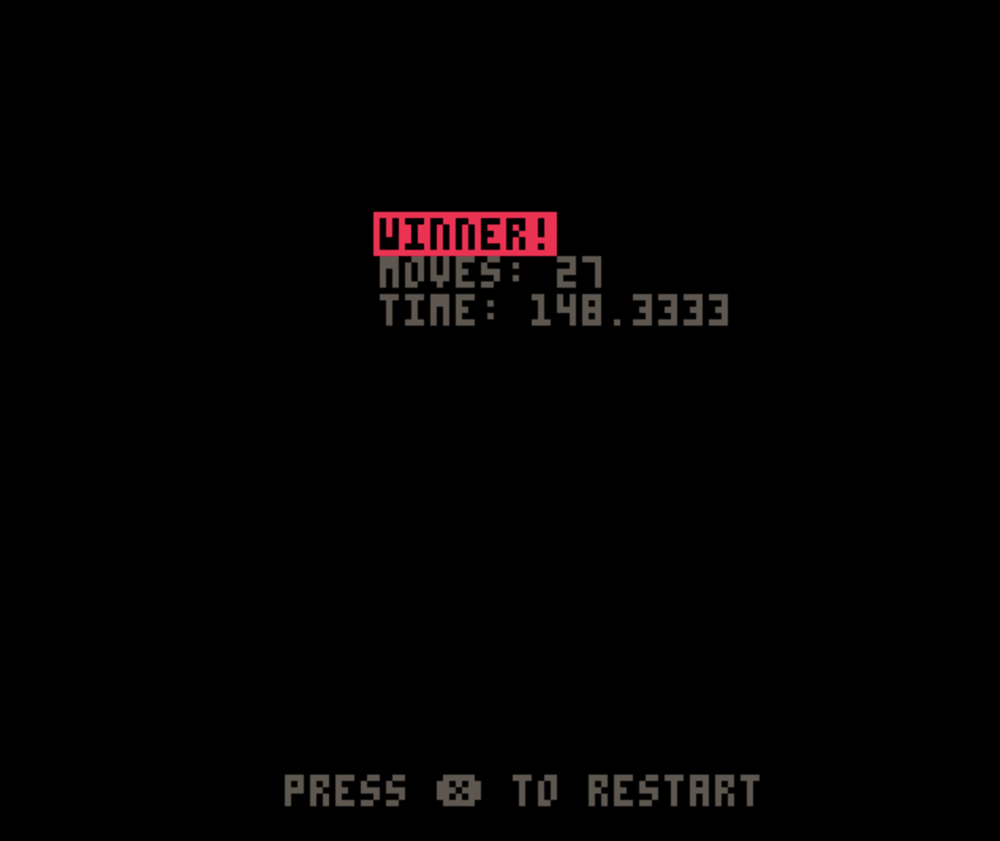

Pico-8 is "a fantasy console for making, sharing, and playing tiny games and other computer programs".  It is similar to a retro game emulator but for hardware that never existed.  Instead of physical cartridges, Pico-8 games are distributed as `.png` images that *look* like cartridges.

One of my favorite ways to play Pico-8 games is on a Linux based handheld console such as the Anbernic RG35xxSP.  I've wanted to make a game on this system for awhile and recently had the motivation.  

This is not intended to be a beginner's guide to Pico-8 as I am still very much learning.  Rather, this is just a place for me to document what I've learned and my progress.

You can play the game I made and will be walking through [here](https://www.lexaloffle.com/bbs/?tid=145173).

# Game Idea
There is a card game called [Flip 9](https://boardgamegeek.com/boardgame/165737/flip-9) that I heard about a long time ago.  In this game, you have nine cards numbered 1-9 in a random order.  The goal is to get the cards in order from 1-9 by swapping two cards at a time.  However, after your first swap, you must swap whichever card was the sum of the two cards you just swapped.  For instance, if you first swap the 1 and the 3, then the next card you swap with must be the 4.  If you swap the 8 with the 4, you would have to swap with the 12.  The cards only go up to 9, so instead you swap with the sum of the digits (1+2), so the 3.  This continues until you correctly get all cards in order from 1-9.  

Nearly 10 years ago, I ade a version of this game in Python and blogged about it [here](/gu-the-game/).  I'm naming this version `goo`.

# Getting started
You can play any Pico-8 game in your browser for free!  However, if you want to play Pico-8 games on your own handheld device or if you want to make your own, you need to buy a copy from [Lexaloffle](https://www.lexaloffle.com/pico-8.php) for $14.99.

Since the code for every Pico-8 game is available with the cart itself, it can be helpful to have two instances of Pico-8 running (one with an example game that is similar to what you want to make, and another with the game you are making).  To do this on Mac, you can open the first instance as usual then run `open -n -a pico-8` in the terminal to open a second.

To see which folder your Pico-8 instance is looking at, just use the command `folder`.  This will open Finder to the folder that Pico-8 is listening to.

The first thing we want to do is create the file.  To do this, run `save <name>`.  For me, this was `save goo`.  Running `folder`, I can now see a new file in my folder named `goo.p8`.  Going forward, you can use the `ctrl+s` keyboard shortcut.

# Pico-8 Basics
There are a few built in commands that Pico-8 looks for and runs automatically.  Those commmands are: 

## _init()
This is called once on program startup and is used to initiate values.

## _update()
Called once per update at 30fps.  Generally, this is used to do calculations that may need to be done.  For instance, checking if a button was placed and changing some value if so.

We will point `_update()` to an internal function called `_upd()` like this: 

```lua
function _update()
	_upd()
end
```

This lets us set `_upd` to some function, which will then be used to update later.

## _draw()
Called once per visible frame.  Generally this is used to draw items onto the screen.  You could put all of your code in either `_update` or `_draw` but generally people separate them out as discussed here.

We will point `_draw()` to an interal function called `_drw()` like this: 

```lua
function _draw()
	_drw()
end
```

Again, this lets us set `_drw` to some function, which will then be drawn.

# Goo 
## Sprites 
This card game doesn't have much going on in the way of sprites which makes it a perfect first game!  

To get to the sprite editor, click on this icon. 

I started by just drawing the border of the cards, then thought I would make the cards fancy (as seen on the right).  I decided I'm not artistic enough to be able to do that 8 more times, so quickly gave it up and instead just used the blank card (on the left).

Pico-8 is limited to only 16 colors, numbered 0-15.  In my sprites, brown (4) will be transparent later.  

Each sprite is 8x8 pixels and has a number.  My card started on sprite 001 and had a width of 4 and a height of 5.  

We will use the sprite number and size later when we put the cards on the screen.

## Screens
Goo will have 4 screens.  Each screen will have two functions, one for what should happen during `_draw()` and one for what should happen during `_update()`.

### Start Screen
This will show the controls and have a button to either start the game or go to a tutorial 



During `_init()`, we will call `show_start_screen()` which will set both `_drw` and `_upd`:
```lua
function show_start_screen()
	_drw = draw_start_screen
	_upd = update_start_screen
end
```

#### draw_start_screen()
This is the simplest of all of our start screens: 

```lua
function draw_start_screen()
	cls()

	print("\^igoo!", 54, 32, t() * 4 % 16)

	print("")
	print("controls:", 0, 70, 10)
	print("⬅️➡️ choose card", 5)
	print("⬆️ toggle card to play", 5)
	print("❎ swap cards", 5)

	print("press ❎ to play", 30, 120, 5 + t() * 10 % 2)
	print("🅾️ for tutorial", 5)
	print(version, 110, 120, 5)
end
```
`cls()` clears the screen, taking away anything that may already be on it.  We will use it at the start of each of our screens so that nothing lingers from previous screens.

`print()` function will print text to the screen.  My first print has `\^i` before the game name.  This is a special command which inverts the colors, meaning it whll be a colored rectangle with  the word `goo` cut out of it.

`t()` is the current time, so `t() * 4 %16` gives a random color over time, causing the start screen to have the game title go through the rainbow.

The screen is just continuing to print more lines down the screen at specific locations and with specific colors.

#### update_start_screen()
The start screen only cares about the `x` or `o` buttons being pressed, so we will just listen to those:

```lua
function update_start_screen()
	cls()
	if btnp(❎) then
		restart_game()
	end
	if btnp(🅾️) then
		show_tutorial_screen()
	end
end
```

`btnp` is a built in Pico-8 function for a button being pressed (not necessarily HELD, but rather PRESSED).  IF the `x` button is pressed, we will call a function that restarts the game, if `o` is pressed, we will show the tutorial screen.

`restart_game()` will be very similar to `show_start_screen()`.  It will set `_upd` and `_drw` to the appropriate functions for the actual game mode.

### Game Screen 
The game will take place on this screen.  This is where most of our logic will live. 


#### draw_game()
Every time `_draw()` is called while on the game screen, `draw_game()` will execute.  It will loop through each card and draw it onto the screen: 

```lua
function draw_game()
	if not in_tutorial then
		cls()
	end

	for i = 1, #hand do
		x = (i - 1) * 12
		y = 60

		local card = hand[i]

		if chosen == i and not card.summed then
			y += 2 * sin(t())
		end

		if card.play then
			y -= 10
		end

		if card.rank == sum then
			y -= 15
		end

		draw_card(card, i, x, y)
	end
end
```

In Pico-8, to get the length of an array (called a *table*), you just do `#<array name>`.  So, `for i = 1, #hand do` is a for loop that will go from 1 to the number of cards in hand (9).

Each card will have an x and y position in pixels that gets set in this loop.  If the card is the *chosen* chard, meaning the card that is being hovered over, the Y value will change according to `2 * sin(t())` which will cause the card to oscillate up and down over time.

If the card is triggered to play, it will move up above the cards just a little bit, so `y -= 10`.  In Pico-8, increasing Y goes down and increasing X goes right. 

If the rank of the card is the sum value, meaning it is the one that must be swapped with next, it will move even further up (so `y -= 15`).  Finally, we actually draw the card onto the screen with `draw_card()`.

```lua
function draw_card(card, idx, x, y)
	clip(x, y, 32, 48)

	palt(0, false)

	palt(4, true)
	-- make background transparent
	if card.rank == idx then
		pal(7, 1)
	end

	if card.highlight then
		pal(11, 10 + t() * 4 % 2)
	end

	-- base background
	spr(1, x, y, 4, 6)
	pal()
	-- rank
	print(card.rank, x + 5, y + 5, 11)

	pal()
end
```
First, I'm using the `clip()` command to limit any drawing or coloring functions to just a specific area of the screen. 

The `palt()` command sets my brown color to transparent, as mentioned previously.  

If the card is in the right place, I want the card background to be blue (1) instead of white (7).  the `pal(7, 1)` command replaces all white with blue.

I want to *highlight* the card that is summed, so if the card's `highlight` attribute is true then I will replace the green border with a flashing yellow: `pal(11, 10 + t() * 4 % 2)`

The `spr` command writes the sprite to the board.  The first number is the sprite number, as discussed early our card boarder sprite starts at sprite 1.  We'll place it in the position `x, y` and we know to use 4x6 sprites: `spr(1, x, y, 4, 6)`

#### update_game()
Here is where the bulk of the logic will live.  We need to check for button presses and set card attirbutes accordingly:

```lua
function update_game()
	if btnp(⬅️) then
		choose_card("desc")
	end
	if btnp(➡️) then
		choose_card("asc")
	end

	if btnp(⬆️) then
		toggle_to_swap(chosen)
	end

	if btnp(❎) then
		swap(chosen)
	end

	set_highlight()

	if win and not in_tutorial then
		show_win_screen()
	end
end
```

### Tutorial Screen
The tutorial screen is a combination of the start screen and a specific shuffle of your hand.  It looks for specific key movements and is more restricted than normal game mode.

### Win Screen
This is what will display when a player gets the cards in order from 1-9.  It will say they are a winner, give the number of moves, and the total time it took.  It will also have an option to restart the game.


It is very similar to the start screen, so we won't discuss it here.


# Conclusion 
You can view the full code for this game in the cart or on my Github [here](https://github.com/allisontharp/pico8/blob/main/carts/goo.p8).

# Helpful Links
- [Pico-8 Homepage](https://www.lexaloffle.com/pico-8.php)
- [Pico-8 Official Manual](https://www.lexaloffle.com/dl/docs/pico-8_manual.html)